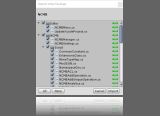

# portfolio-tejun
ポートフォリオ手順確認

atomで追加

# 見出し1
## 見出し2
### 見出し3
**太字** **Bold**

*斜体* *Italic*

- 箇条書き
  - 箇条書き
      - 箇条書き

[リンク](link.md)

- 太字(Bold)、斜体(Italic)、打消し線(Strikethrough)
- 埋め込みコードブロック( code block within a line )
- 独立したコードブロック( its own distinct block )
- unityroomやclusterへのリンク
- 作品のスクリーンショットなどの画像
  - マークダウン内にはimgタグが使える。画像のサイズ指定をしたい場合はimgタグを使う
    - ``など
- 箇条書き(Lists)
- 通し番号つきリスト(Order Lists)
- 箇条書きの字下げ(Nested Lists)
- タスクリスト
- 段落(Paragraphs)
- 補足(Footnotes)
